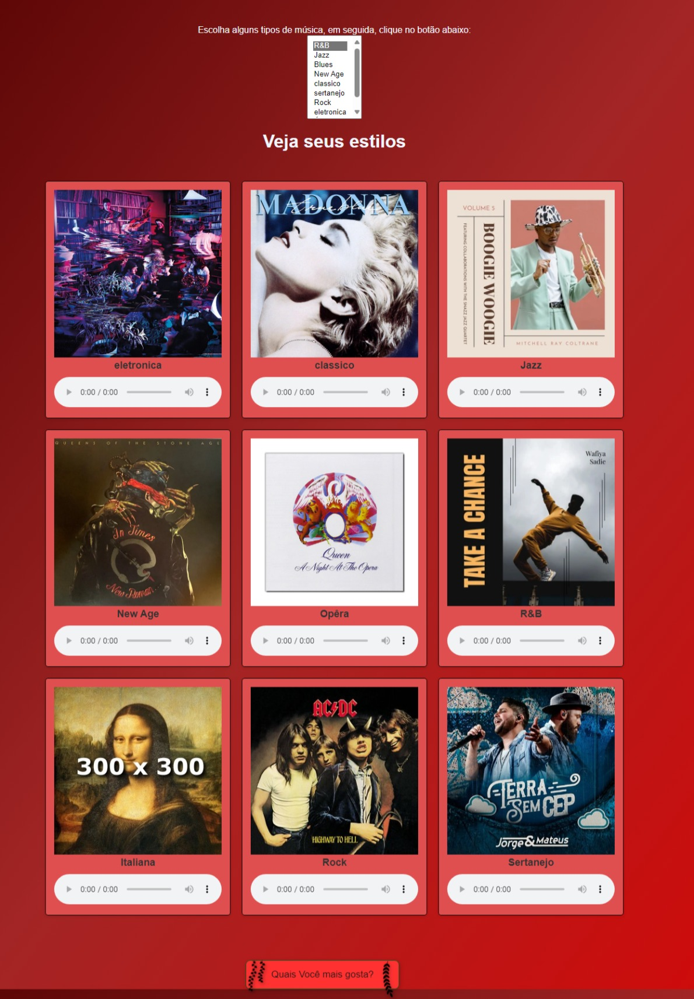
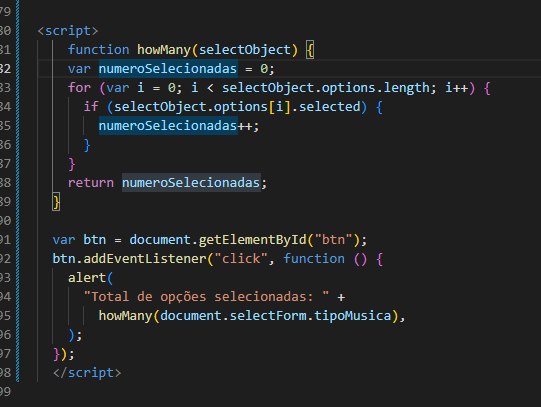

# Site de escolhas de musica

E um projeto onde você pode escolher tipos de musica a sua escolha, de rock ate classica, ainda em andamento e possiveis melhoras

## Screenshots

## Funcionalidades

- Escolhas de musicas
- Poder ouvir as musicas antes de escolher
- Modo tela cheia
- Varios estilos de muicas

## Documentação Novo apredizado

<<<<<<< HEAD
[Documentação](imagens/teste.png)
=======
>>>>>>> 6a7a4aaeb9307588af3ac98485e87ad4e0dbffbd

Em JavaScript, o for é uma estrutura de controle de fluxo utilizada para iterar sobre uma sequência de elementos, como os elementos de um array. Ele permite executar um bloco de código repetidamente enquanto uma condição específica for verdadeira.
## Aprendizados

* for
* while
* var
* select

## Autores

- [@JoseWalterDeOliveiraJunior](https://github.com/Queijitos)

